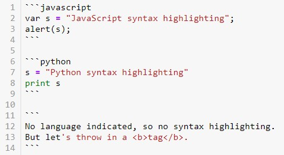

<h1>Table of Contents<span class="tocSkip"></span></h1>
<div class="toc"><ul class="toc-item"><li><span><a href="#Headers" data-toc-modified-id="Headers-1"><span class="toc-item-num">1&nbsp;&nbsp;</span>Headers</a></span></li><li><span><a href="#Horizontal-Rule" data-toc-modified-id="Horizontal-Rule-2"><span class="toc-item-num">2&nbsp;&nbsp;</span>Horizontal Rule</a></span></li><li><span><a href="#Emphasis" data-toc-modified-id="Emphasis-3"><span class="toc-item-num">3&nbsp;&nbsp;</span>Emphasis</a></span></li><li><span><a href="#Lists" data-toc-modified-id="Lists-4"><span class="toc-item-num">4&nbsp;&nbsp;</span>Lists</a></span></li><li><span><a href="#Links" data-toc-modified-id="Links-5"><span class="toc-item-num">5&nbsp;&nbsp;</span>Links</a></span></li><li><span><a href="#Code-and-Syntax-Highlighting" data-toc-modified-id="Code-and-Syntax-Highlighting-6"><span class="toc-item-num">6&nbsp;&nbsp;</span>Code and Syntax Highlighting</a></span><ul class="toc-item"><li><span><a href="#general-highlight" data-toc-modified-id="general-highlight-6.1"><span class="toc-item-num">6.1&nbsp;&nbsp;</span>general highlight</a></span></li></ul></li><li><span><a href="#Blockquotes" data-toc-modified-id="Blockquotes-7"><span class="toc-item-num">7&nbsp;&nbsp;</span>Blockquotes</a></span></li><li><span><a href="#Task-Lists" data-toc-modified-id="Task-Lists-8"><span class="toc-item-num">8&nbsp;&nbsp;</span>Task Lists</a></span></li><li><span><a href="#Inline-HTML" data-toc-modified-id="Inline-HTML-9"><span class="toc-item-num">9&nbsp;&nbsp;</span>Inline HTML</a></span></li><li><span><a href="#Images" data-toc-modified-id="Images-10"><span class="toc-item-num">10&nbsp;&nbsp;</span>Images</a></span><ul class="toc-item"><li><span><a href="#use-IPython.display" data-toc-modified-id="use-IPython.display-10.1"><span class="toc-item-num">10.1&nbsp;&nbsp;</span>use IPython.display</a></span></li></ul></li><li><span><a href="#Videos,-Audios" data-toc-modified-id="Videos,-Audios-11"><span class="toc-item-num">11&nbsp;&nbsp;</span>Videos, Audios</a></span><ul class="toc-item"><li><span><a href="#use-IPython.display" data-toc-modified-id="use-IPython.display-11.1"><span class="toc-item-num">11.1&nbsp;&nbsp;</span>use IPython.display</a></span></li></ul></li><li><span><a href="#External-sites" data-toc-modified-id="External-sites-12"><span class="toc-item-num">12&nbsp;&nbsp;</span>External sites</a></span></li><li><span><a href="#References" data-toc-modified-id="References-13"><span class="toc-item-num">13&nbsp;&nbsp;</span>References</a></span></li></ul></div>

IPython.display sections might not render Markdown properly. Open [Jupyter Notebook](MarkDown.ipynb) to view these. 

# Headers


```python
# Headers
## H2
### H3
#### H4
##### H5
###### H6


**Alternatively, for H1 and H2, we can use an underline-ish style:** 

H1
===

H2
---
```

# Horizontal Rule


```python
Three or more...

Asterisks
***


Underscores
___


```

Asterisks
***


Underscores
___


# Emphasis


```python
Emphasis, aka italics, with *asterisks* or _underscores_.

Strong emphasis, aka bold, with **asterisks** or __underscores__.

Combined emphasis with **asterisks and _underscores_**.

Strikethrough uses two tildes. ~~Scratch this.~~
```

Emphasis, aka italics, with *asterisks* or _underscores_.

Strong emphasis, aka bold, with **asterisks** or __underscores__.

Combined emphasis with **asterisks and _underscores_**.

Strikethrough uses two tildes. ~~Scratch this.~~

# Lists


```python
1. First ordered list item
2. Another item
 * Unordered sub-list. 
  
**To have nested list, we need to give a leading space.**  
To have a list items/paragrapgh lines together we need to give a trailing space (may be two).
  
  
1. Actual numbers don't matter, just that it's a number
 1. Ordered sub-list
4. And another item.


**To have a line break without a paragraph, you will need to use two trailing spaces.**  
Note that this line is separate, but within the same paragraph. 

* Unordered list can use asterisks
- Or minuses
+ Or pluses
```

1. First ordered list item
2. Another item
 * Unordered sub-list. 
  
**To have nested list, we need to give a leading space.**  
To have a list items/paragrapgh lines together we need to give a trailing space (may be two).
  
  
1. Actual numbers don't matter, just that it's a number
 1. Ordered sub-list
4. And another item.


**To have a line break without a paragraph, you will need to use two trailing spaces.**  
Note that this line is separate, but within the same paragraph. 

* Unordered list can use asterisks
- Or minuses
+ Or pluses

# Links


```python
[I'm an inline-style link](https://www.google.com)

[I'm an inline-style link with title](https://www.google.com "Google's Homepage")

[I'm a reference-style link][Arbitrary case-insensitive reference text]

[I'm a relative reference to a repository file](../blob/master/LICENSE)

[You can use numbers for reference-style link definitions][1]

Or leave it empty and use the [link text itself].

URLs and URLs in angle brackets will automatically get turned into links. 
http://www.example.com or <http://www.example.com> and sometimes 
example.com (but not on Github, for example).

Some text to show that the reference links can follow later.

[arbitrary case-insensitive reference text]: https://www.mozilla.org
[1]: http://slashdot.org
[link text itself]: http://www.reddit.com
```

[I'm an inline-style link](https://www.google.com)

[I'm an inline-style link with title](https://www.google.com "Google's Homepage")

[I'm a reference-style link][Arbitrary case-insensitive reference text]

[I'm a relative reference to a repository file](../blob/master/LICENSE)

[You can use numbers for reference-style link definitions][1]

Or leave it empty and use the [link text itself].

URLs and URLs in angle brackets will automatically get turned into links. 
http://www.example.com or <http://www.example.com> and sometimes 
example.com (but not on Github, for example).

Some text to show that the reference links can follow later.

[arbitrary case-insensitive reference text]: https://www.mozilla.org
[1]: http://slashdot.org
[link text itself]: http://www.reddit.com

# Code and Syntax Highlighting

Code blocks are part of the Markdown spec, but syntax highlighting isn't. 

However, many renderers -- like Github support syntax highlighting. Which languages are supported and how those language names should be written will vary from renderer to renderer. 

Blocks of code are either fenced by lines with three back-ticks ```, or are indented with four spaces. Use fenced code blocks -- they're easier and only they support syntax highlighting.


```python
Inline `code` has `back-ticks around` it.
```

Inline `code` has `back-ticks around` it.



```javascript
var s = "JavaScript syntax highlighting";
alert(s);
```

```python
s = "Python syntax highlighting"
print(s)
```

```
No language indicated, so no syntax highlighting. 
But let's throw in a <b>tag</b>.
```

## general highlight

*If its not visible, you might need to execute the cell.*

```python
<mark>Marked text</mark>

<mark style="background-color: lightblue">Marked text</mark>

```

<mark>Marked text</mark>

<mark style="background-color: lightblue">Marked text</mark>


# Blockquotes


```python
> Blockquotes are very handy in email to emulate reply text.  
> This line is part of the same quote.

> Blockquotes are very handy in email to emulate reply text.
> This line is part of the same quote but is on a newline due to 2 trailing spaces on 1st line


Quote break.

> This is a very long line that will still be quoted properly when it wraps. Oh boy let's keep writing to make sure this is long enough to actually wrap for everyone. Oh, you can *put* **Markdown** into a blockquote. 
```

> Blockquotes are very handy in email to emulate reply text.
> This line is part of the same quote.

> Blockquotes are very handy in email to emulate reply text.  
> This line is part of the same quote but is on a newline due to 2 trailing spaces on 1st line.


Quote break.

> This is a very long line that will still be quoted properly when it wraps. Oh boy let's keep writing to make sure this is long enough to actually wrap for everyone. Oh, you can *put* **Markdown** into a blockquote. 

# Task Lists


```python
Task lists allow you to create a list of items with checkboxes. To create a task list, add dashes (-) and brackets with a space ([ ]) in front of task list items. To select a checkbox, add an x in between the brackets ([x]) 

- [x] Finish my changes
- [ ] Push my commits to GitHub
- [ ] Open a pull request

If a task list item description begins with a parenthesis, you'll need to escape it with \:
- [ ] \(Optional) Open a followup issue


```


 - [x] Finish my changes  
 - [ ] Push my commits to GitHub  
 - [ ] Open a pull request  

If a task list item description begins with a parenthesis, you'll need to escape it with \\:

 - [ ] \(Optional) Open a followup issue


# Inline HTML


```python
<dl>
  <dt>Definition list</dt>
  <dd>Is something people use sometimes.</dd>

  <dt>Markdown in HTML</dt>
  <dd>Does *not* work **very** well. Use HTML <em>tags</em>.</dd>
</dl>
```

<dl>
  <dt>Definition list</dt>
  <dd>Is something people use sometimes.</dd>

  <dt>Markdown in HTML</dt>
  <dd>Does *not* work **very** well. Use HTML <em>tags</em>.</dd>
</dl>

# Images


```python
Here's our logo (hover to see the title text):

Inline-style: 


Reference-style: 
![alt text][logo]

[logo]: https://github.com/adam-p/markdown-here/raw/master/src/common/images/icon48.png "Logo Title Text 2"
```

Here's our logo (hover to see the title text):

Inline-style: 


Reference-style: 
![alt text][logo]

[logo]: https://github.com/adam-p/markdown-here/raw/master/src/common/images/icon48.png "Logo Title Text 2"

## use IPython.display

Open [Jupyter Notebook](MarkDown.ipynb) to view this properly. 


```python
from IPython.display import Image

img_url = 'https://upload.wikimedia.org/wikipedia/commons/thumb/4/46/Colored_neural_network.svg/300px-Colored_neural_network.svg.png'

# by default Image data are embedded
Embed = Image(img_url)

# if 'url' parameter is given, the embedding is assumed to be false
# will display image after cell is run
SoftLinked = Image(url=img_url)

# In each case, embed can be specified explicitly with the 'embed' parameter
ForceEmbed = Image(url=img_url, embed=True)
```


```python
Embed
```


```python
SoftLinked
```


# Videos, Audios

They can't be added directly but you can add an image with a link to the video like this:

```html
<a href="http://www.youtube.com/watch?feature=player_embedded&v=jGwO_UgTS7I" target="_blank"></a>
```

<a href="http://www.youtube.com/watch?feature=player_embedded&v=jGwO_UgTS7I" target="_blank"></a>

Or, in pure Markdown, but losing the image sizing and border:

```
[](http://www.youtube.com/watch?v=jGwO_UgTS7I)
```


[](http://www.youtube.com/watch?v=jGwO_UgTS7I)

## use IPython.display

Open [Jupyter Notebook](MarkDown.ipynb) to view this properly.  
*If still not visible, you might need to execute the cell as it's accessing an external site.*


```python
from IPython.display import YouTubeVideo

YouTubeVideo('jGwO_UgTS7I', width=400, height=300)
```


        <iframe
            width="400"
            height="300"
            src="https://www.youtube.com/embed/jGwO_UgTS7I"
            frameborder="0"
            allowfullscreen
        ></iframe>
        


```python
from IPython.display import Audio

Audio(url="http://www.nch.com.au/acm/8k16bitpcm.wav")
```


                <audio  controls="controls" >
                    <source src="http://www.nch.com.au/acm/8k16bitpcm.wav" type="audio/wav" />
                    Your browser does not support the audio element.
                </audio>
              


# External sites

Open [Jupyter Notebook](MarkDown.ipynb) to view this properly.  
*If still not visible, you might need to execute the cell as it's accessing an external site.*


```python
from IPython.display import IFrame

IFrame('https://en.wikipedia.org/wiki/Machine_learning?useformat=mobile', width='100%', height=350)
```


        <iframe
            width="100%"
            height="350"
            src="https://en.wikipedia.org/wiki/Machine_learning?useformat=mobile"
            frameborder="0"
            allowfullscreen
        ></iframe>
        


# References

1. https://www.markdownguide.org/extended-syntax/


2. http://louistiao.me/posts/demos/ipython-notebook-demo/


3. https://github.com/adam-p/markdown-here/wiki/Markdown-Cheatsheet


```python

```
